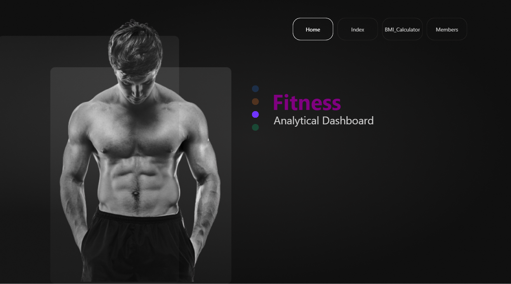
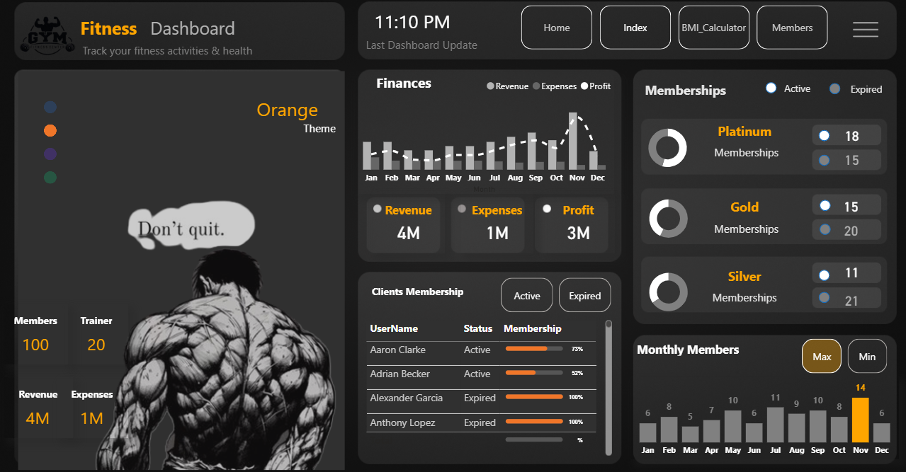
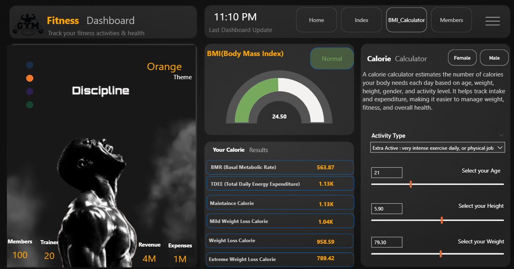
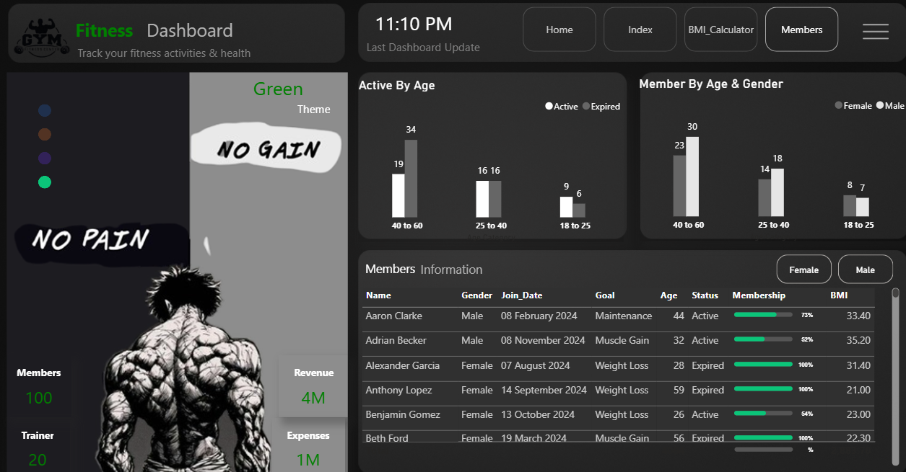

# 🏋️‍♂️ Fitness Analytical Dashboard  

An interactive and visually engaging dashboard designed to track **fitness activities, memberships, financial performance, and client health metrics** — all in one place.  

This project combines **Power BI, Python, and Excel** to showcase how data visualization can transform raw data into **actionable insights** for gyms, trainers, and fitness enthusiasts.  

----

## 🚀 Project Overview  
The Fitness Analytical Dashboard provides a holistic view of:  
- 👥 Member and trainer management  
- ⚖️ BMI & Calorie tracking  
- 💰 Revenue, expenses, and profit monitoring  
- 🔄 Membership retention and churn analysis  
- 📈 Seasonal growth insights  

The goal is to **bridge the gap between fitness tracking and business analytics**, making it easier for gyms and fitness centers to improve both **health outcomes and business performance**.  

----

## 📊 Dashboard Features  

✅ **Membership Insights** → Active vs. expired members, age & gender segmentation  
✅ **BMI & Calorie Calculator** → Personalized fitness planning  
✅ **Financial Overview** → Revenue, expenses & net profit trends  
✅ **Membership Plans Analysis** → Platinum ⭐ | Gold 🥇 | Silver 🥈  
✅ **Seasonality Trends** → Peak signups (e.g., November 📈)  

---

## 💡 Key Insights Derived  

- Middle-aged clients (40–60) show the **highest retention**, while younger groups (18–25) need **better engagement**.  
- **Platinum plan** members are the most **loyal**, while **Silver plan** has the **highest dropout rate**.  
- Despite high workout engagement, some members’ **BMI suggests a need for balanced calorie management**.  
- Profitability is strong (**$3M net**), but **expense optimization** could unlock further growth.  

---

## 🛠️ Tools & Technologies Used  

- **Power BI** → For data visualization & dashboard design  
- **Python** → For data preprocessing and analysis  
- **Excel** → For dataset preparation and calculations  

---

## 📂 Project Files  

- `Fitness_Home.png` → Dashboard Home Page  
- `Fitness_Index.png` → Index/Navigation Page  
- `Fitness_Calculator.png` → BMI & Calorie Calculator  
- `Fitness_Members.png` → Membership Analytics  
- `Fitness_Analysis.pdf` → Detailed report with complete insights  

---

## 📸 Dashboard Screenshots  

| Home Page | Index Page |  
|-----------|------------|  
|  |  |  

| Calculator Page | Membership Analytics |  
|-----------------|----------------------|  
|  |  |  

---

## ✨ Why This Matters  

This project demonstrates how analytics can empower fitness centers to:  
- 📌 Increase client retention  
- 📌 Optimize revenue streams  
- 📌 Personalize health plans  
- 📌 Make data-driven business decisions  

---

## 🔗 Access the Dashboard & Report  

📂 **[Download Detailed Report (PDF)](https://github.com/Shubham1919284/-Fitness_Analytical_Dashboard/blob/9363bdf6160fe01e111a67bd44536db19ae2e36f/Fitness_Analytical_Dashboard.pdf)**  
📊 **Explore Dashboard Screenshots (above)**  

---

## 🙌 Let’s Connect  

If you find this project interesting, feel free to ⭐ the repo and share your thoughts!  

- 🔗 [LinkedIn – Shubham Kumar Jha](https://www.linkedin.com/in/shubham-kumar-jha-1a2b3c)  
- 💻 [GitHub – Shubham1919284](https://github.com/Shubham1919284)  

---
